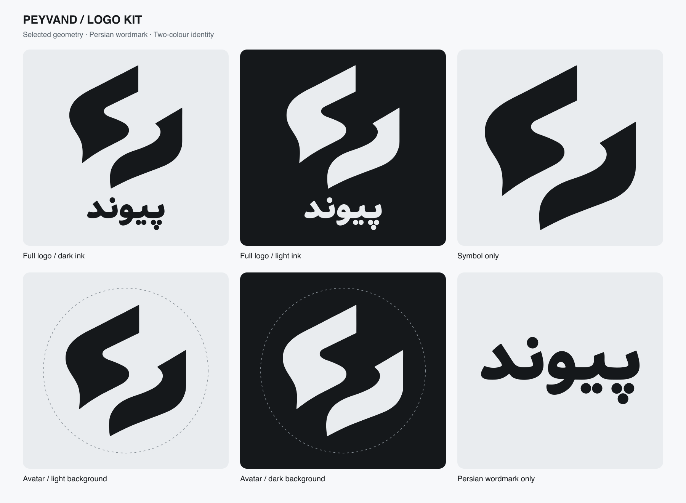

# Peyvand logo kit

Production variations of the selected **پیوند** logo: the abstract two-stroke symbol, smaller Persian wordmark, and no Iran detail.



## Choose a file

| Use | Files | Details |
|---|---|---|
| Full logo on light surfaces | [Dark-ink SVG](svg/peyvand-logo-dark-ink.svg), [PNG](png/peyvand-logo-dark-ink-2172.png) | Transparent, near-black artwork. PNG sizes: 1086 × 1448 and 2172 × 2896. |
| Full logo on dark surfaces | [Light-ink SVG](svg/peyvand-logo-light-ink.svg), [PNG](png/peyvand-logo-light-ink-2172.png) | Transparent, cool light-grey artwork. Same sizes and geometry as the dark version. |
| Watermark or compact symbol | [Dark SVG](svg/peyvand-symbol-dark-ink.svg), [light SVG](svg/peyvand-symbol-light-ink.svg), [PNGs](png/) | Symbol only, transparent; 1024 × 1108 and 256 × 277 PNGs. |
| Persian wordmark on its own | [Dark SVG](svg/peyvand-wordmark-dark-ink.svg), [light SVG](svg/peyvand-wordmark-light-ink.svg), [PNGs](png/) | Original outlined lettering and dots, transparent; 1600 × 757 PNGs. |
| Profile avatar | [Light background](avatars/peyvand-avatar-light-bg.png), [dark background](avatars/peyvand-avatar-dark-bg.png) | 1024 × 1024 opaque PNGs; matching SVGs in `avatars/`. Symbol placement is safe inside a circular crop. |
| Editable source | [Vector master](master/peyvand-logo-master.svg) | Native paths with separate `stroke-left`, `stroke-right`, and `wordmark` groups. |
| Animation components | [Left stroke](motion/stroke-left.svg), [right stroke](motion/stroke-right.svg), [wordmark](motion/wordmark.svg) | Separate transparent SVGs, all using the same 1086 × 1448 canvas and original coordinates. |

`dark-ink` describes the artwork colour, not the background. `light-bg` and `dark-bg` describe the opaque avatar background. All PNGs in `png/` have genuine alpha transparency. The dashed circles shown in the preview are crop guides only and do not appear in the avatar files.

## Palette and geometry

- Near-black: `#15181B`.
- Cool light grey: `#E9ECEF`.
- All production variants derive from a single vector master, so corresponding dark/light outlines and alpha masks are identical.
- The vector preserves the selected proportions and original Persian lettering, including all six dots. There is no live-font dependency or embedded bitmap.
- The selected raster reference remains unchanged in the repository at `assets/branding/peyvand-logo.png`. The production master normalizes its subtle generated colour variation to flat fills.

## Use and motion

Use the complete logo where its lettering has room to remain readable. Use the symbol-only version for small watermarks and avatars. Scale uniformly, preserve the gap between strokes, and retain the existing symbol-to-wordmark proportion.

For motion, place the three component files at the same canvas origin. Together they reproduce the master. Keep all lettering and dots together in the `wordmark` group. Timing, choreography, sound, and the final animated reveal are still to be designed.

The canonical editable source in the repository is `assets/branding/master/peyvand-logo-master.svg`; `master/` in this kit is a distributable copy. Edit the canonical source and regenerate exports rather than editing the PNGs individually.

## Verification and provenance

The SVG trace overlaps the selected reference silhouette by **99.695%**, with a maximum measured boundary deviation of **1 source pixel**. See [geometry validation](master/geometry-validation.json).

[Export validation](validation.json) checks matching alpha masks, transparent corners and letter counters, flat colours, all six Persian dots, avatar crop clearance, and unchanged path data in animation components. [manifest.json](manifest.json) records every exported SVG/PNG and its dimensions where applicable.

Built-in image generation was used for initial transparent-cutout trials. Those trials had edge artifacts and were discarded. Final files are native SVG derivatives and direct `rsvg-convert` exports of the approved vector trace; they do not use the flawed trial PNGs. The exact trial prompts are retained in [generation-notes.md](generation-notes.md).

To rebuild from the repository root:

```sh
.venv/bin/python scripts/build_logo_master.py
.venv/bin/python scripts/export_logo_kit.py
```

The first command reconstructs the trace from the selected raster, so skip it when preserving intentional manual edits to the canonical SVG. The exporter uses the master and its geometry metadata, then runs its built-in validation checks.
